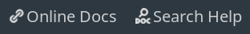

## Introduction

Do you love playing video games? I sure do! I enjoy making games too, and it's highly likely that you would too.
Game development is an umbrella term for ranging from designing levels, mechanics to coding the logic to making art and music.
It has a little something for everyone. If you would like to learn how to make games, then this guide is a great place to start, if I do say so myself.

In this guide, we will make an X and O game using Godot.
This is a great first game to make as it is not too complex, and yet it
covers many important aspects of game development.

We will look at some of the most important programming paradigms in game development.
We will learn how to make games using Godot.

There are no prerequisites, except for critical thinking, reasoning, and basic computer skills. Prior programming experience is helpful, but not necessary.
The goal of the guide is to get you comfortable with using Godot to build simple games.

By the end of this guide, you will be able to:

- Design a gameplay loop for the game
- Create a complete working game
  - Display images and text in the game
  - Keep track of the state of the game
  - Listen for clicks in an area
  - Detect and respond to keyboard presses
  - Create, emit, and connect signals
  - Decide and check win conditions of a game
- Export your game and share it with others

### About Godot

We will use Godot -- an amazing game engine -- to make our game.
A game engine is software that handles and integrates various aspects of game development: graphics, physics, logic, sound, interface, input, and more.
Some other popular game engines are Unity and Unreal.
I will describe some advantages that Godot has over them.

- Godot is free and open-source.
  You can visit [Godot's GitHub page](https://github.com/godotengine/godot) and look at Godot's source code. You can study how it's made and how it works.
  You can report bugs and contribute to the codebase yourself.

- Any game that you make using Godot belongs to you, and any profit you make is yours to keep. This is not the case with most other game engines.

- Godot works on Windows, macOS, and Linux. In particular, Godot has first-class support for
  Linux. Since I primarily use Linux, this is perfect for me.

- Godot is lightweight. Godot is only a 35 MB download, it starts up in seconds, and is very light on CPU and memory.

- Godot is a joy to use. The UI is simple and shows you only what you need to see, allowing you to focus on your work. It is also customisable: you can change the colour scheme and the fonts of the editor as you please.

You can download Godot for free from [Godot's website](https://godotengine.org/download). We will write code in GDScript and not C#, so we do not need the Mono version. Select
your operating system, download the Standard version, and extract
and run!


btw, I use arch.  If you use Arch Linux, installing Godot is even easier.  Just `pacman -S godot`!


This guide uses Godot 3.3.2, the latest stable version available at the time
of writing. Godot tries to maintain backward compatibility, so this guide should work for future versions of Godot 3 as well.

The complete code of the finished version of the game is available on my GitHub page.
If you face any issue, if something's not working, you can compare your code with it.
You can also play the final version game to see how it works on my itch.io page.

Let's get started!

## Setting things up

### Planning the game

Before we start any work on a game in Godot, it is important to plan out how the game would look and behave.
Having a concrete picture of the game in mind will help us when we develop the game in Godot.

Here are some helpful questions that we can ask:

- What is the genre/theme of the game?
- What is the name of the game?
- How many players can play the game? (single-player or multiplayer)
- What are the objectives of the game?
- What device will it be played on?
- How does the user interact with the game?
- How does the user interface look like?
- What happens in a typical gameplay?
- How long does a gameplay session last?

This list isn't exhaustive, but it gets you thinking about most major details of the game.
The answers to these questions will directly impact the decisions you take when you develop the game. For example,

- The theme of the game will affect the choice of your art, sound, and music.
- A multiplayer game will have different input systems and networking requirements compared to a single-player game.
- Games developed for mobile will have a different interface compared to games developed for desktop.


Of course, the answers to these questions are not fixed; they will most likely change as you work on the game. 
As you build the game and test it, you might find that a feature you had planned doesn't do well in practice.

- You might come up with a better alternative during development.
- Your idea might be too complex to explain to the player.
- It might not be as exciting as you thought it would be.
- It might be hard to implement because of some technical limitations.

Be open to making changes to your game as you work on it. 


Let's answer these questions for our X and O game.

- It is a puzzle game. It is bright and colourful.
- We will call it "X and O".
- It is played by two players.
- The objective of the player is to place three of the same symbol in a row, column, or diagonal.
- It can be played on desktop.
- The player clicks on the squares to enter symbols.
- I have made a rough sketch how the interface would look like. This will be a simple game with just one scene. In more complex games, we would need more scenes.
  
- We will describe the gameplay loop using a flowchart. It will also tell us how long a session will last.

### The gameplay loop

We want to write down how the state of the game changes as the player plays the game.
We want to explicitly state how the game receives inputs, what decisions it takes, what changes it makes, and how all of these relate to each other.

"X and O" is a small and simple game, so its gameplay loop is simple too.



To summarise:

- When the game starts, we listen for clicks on the grid.
- When the player clicks on a cell, we show the appropriate symbol in that cell.
- We then compute if someone has won. If not, then we check if the game has drawn.
- If the game has ended (by a win or a draw), then we display the name of the winner and give an option to start a new game. Otherwise, we go back to listening for clicks.

Each round of the game lasts no more than a minute. Players may play multiple rounds in a session.

Now that we have a good picture of how the game would work, we are ready to start working in Godot.

### Project setup

Open Godot and create a new project. We will call it `x-and-o`. Choose an empty folder to save the project in, preferably with the same name as the game.
Select "Create & Edit" to create the project.



By default, when we start a new project, Godot starts in 3D mode. We are making a 2D game, so switch to 2D mode by clicking on "2D" at the top. The default shortcut to enter 2D mode is <kbd>Ctrl</kbd> + <kbd>F1</kbd>.



Screens come in a variety of shapes and sizes. Some are square, some are tall, some are wide.
We want our game to render correctly on all screens.
Since this is our first game, we will keep it simple.
We will target a fixed resolution, so we do not have to worry about making the layout responsive.

To achieve this, open Project -> Project Settings.



In the General tab, look for the section named "Window" in "Display".

- Set `Width` to `1280` and `Height` to `720`. This sets the aspect ratio of the game to 16:9, the most common aspect ratio for screens.
- In the same section, scroll down to "Stretch", and set `Mode` to `2d` and `Aspect` to `keep`. Now, if the aspect ratio of the screen is not 16:9, then Godot will not distort the content. It will pad the content with black bars instead.

This way our game looks reasonably good on all screens with minimal effort. We will learn how to make a responsive layout another time.

By default, the background colour of the game is dark grey. Let's change the background colour. In the same "General" tab of project settings, go to Rendering -> Environment -> Default Clear Colour.
As mentioned before, I want the game to be bright and colourful.
I set it to `#ffffff`, which is the hex code for white. Feel free to choose a colour that goes with your theme.

### Importing assets

Looking at the sketch interface, we see that we need to display some X's, some O's, and the grid on the screen.
We would load the images for these in Godot.
We show some text in our game, and we will need to load a nice font for it.

I have made an assets folder that you can use to make the game. It contains `x.png`, `o.png`, `grid.png`, and `Inter-Regular.ttf`.
You can <NavExtLink to="/">download my assets</NavExtLink>, or you can make your own.




I made the png files for X, O, and the grid using [Inkscape](https://inkscape.org/). It is an excellent application for making vector art. It is free software, and I highly recommend it.


I have included the `Inter` font in the assets. I chose this font because it looks sharp even at low resolutions and it goes well with the "X" and "O" sprites that I have made. You can use any font that goes with your theme.




You can get fonts on websites such as [Google fonts](https://fonts.google.com/) and [dafont.com](https://www.dafont.com/theme.php?cat=501&l[]=10). Make sure you have the rights to use the font you choose.


We need to add these assets to our project in Godot.
Make an `assets` folder in your game's root folder `x-and-o` using your file manager. (Use File Explorer if you are using Windows, Finder if you are on macOS). Move the sprites and the font in it.
When you open Godot, you will see those files in the FileSystem tab.



## Building the interface

We have imported all the resources that we need in Godot. We can now start building the user interface.

Whether we want to display an image, play a sound, or display some text in Godot, we do so by adding a node for it. A Godot game is made by composing together different kinds of nodes.


Read the [Godot docs on Scenes and Nodes](https://docs.godotengine.org/en/stable/getting_started/step_by_step/scenes_and_nodes.html) to understand how they work.


We will add a root node that will hold all nodes in our game.
Click on `Create root node` -> `2D node` in the Scene tab. This will create a root node named `Node2D`. Rename it to `Game`.



Now that we have a root node, we can save the scene and run the game. Save the scene by pressing <kbd>Ctrl</kbd>+<kbd>S</kbd>.
Make a `scenes` folder in the root directory and save this scene in it as `Game.tscn`.




Scenes are saved with the `.tscn` file extension.


Run the game by clicking the play button (or press <kbd>F5</kbd>). The first time you run the game, Godot will ask you to set the main scene. The main scene is the scene that loads when you run the game. Select the `Game.tscn` scene we just saved.



Of course, we haven't added anything to our scene yet, so we only see a blank screen when the game is run.
Close the window (or press <kbd>F8</kbd>) to stop the preview.

We look to our sketch to help us build the interface. We need a grid, some X's, some O's, and some text labels.

Let's start with the labels because they are simpler.

### Labels

We can display text in a game with a `Label` node. Select `Game` and click on the plus icon to add a child node. In the "Create New Node" dialog that appears, search for `Label`, and click on "Create".



A `Label` node appears as a child of `Game` in the scene tab.
Rename the name of this node to `GameName` because that's what it is.



We do not see any change in our game because the label has no text. We can add/edit the text of the `Label` by editing the `Text` property in the inspector tab. This label will display the name of the game: "X and O". Change the text of the label to "X and O".



The label is hard to read: it is small and is white on a white background. We will fix this by using a custom font.



In the inspector tab, in `Custom Fonts`, enable the Font property. Click on Empty -> New DynamicFont.



Click on "Dynamic Font" to show some additional settings. In Font -> Font Data, click on Empty -> Load and select your font file. We can adjust the font size in `Settings`. We would like the name of the game to be big, so I set the font size to `96`. We can also change the font colours in Custom Colours -> Font colours. Play with the parameters until you have happy with the appearance.



We have three more labels to show in our interface. Repeat this process three times to end up with a total of four labels.
I made three new `Label` nodes with names `WinCondition`, `PlayerTurn`, and `PlayerInstruction`. My game looks like this now.




Enable "Grid Snap" in the toolbar to make it easier to align items.




Our text looks good. Next, we will add the grid.

### The Grid

The grid is a bit more complex. In addition to showing the grid, we also need to listen for clicks and display an "X" or "O" in each of the nine cells.

Create a 2D node and name it `Grid`. We will store all nodes related to the grid as children of this node. This will make our `Game` scene more organised.

We can show images in Godot using the `Sprite` node.
Add a child node to `Grid` of type `Sprite`, and rename the node to `GridSprite`.
We do not see any change in our game because the sprite does not have a texture. Drag and drop `grid.png` from the FileSystem to the `Texture` property of the sprite.

We can see the grid in our game now, but it's too big for our screen. We need to scale it down.



In `GridSprite`, in transform, set the Scale to `0.3` and `0.3`.



The grid fits in the screen now.



We want to be able to detect clicks.
We can detect clicks in an area using the `Area2D` node. We will have nine `Area2D` nodes, one for each cell of the grid.

First, let's add one `Area2D` node as a child of `Grid`, and rename it to `GridCell`. This gives
a yellow warning symbol. Hover over it, and it tells us to add a `CollisionShape2D` as a child.
We get this warning because we have an `Area2D` node, but we haven't defined its area. Add a `CollisionShape2D` as a child of `GridCell` to remove this warning.

The `CollisionShape2D` now shows a warning: it needs a shape to function. Our cells are squares, so we select New RectangleShape2D in the inspector tab.



Resize and move the blue area so it covers one of the grid cells.
Using Grid Snap will make it easier to fit the CollisionShape2D on the cell perfectly.



We would like to show "X" and "O" symbols in the cells when the game is played. Recall that we show images using the `Sprite` node.
Add a `Sprite` as a child of `GridCell`, and rename it to `CellSymbol`. Choose the texture as `x.png`. If you are using my assets, you will need to scale it to `0.3` and translate it by `96` and `96` to centre the image in the cell.

Our `GridCell` node is ready. We could duplicate it nine times and our game would work.
However, if we want to make any changes to this node in the future, we would have to apply the changes on all nine nodes. This is tedious at best, and a source for errors at worst.

We solve this problem by saving the `GridCell` node as a scene. Then, anytime we want to use this node, we can create an instance of it. Any changes that we make to the `GridCell` scene will be reflected in all of its instances.

To save the node as a scene, right-click on the node in the Scene tab, select "Save Branch as Scene", and save it as `GridCell.tscn` in the `scenes` folder.

The `GridCell` node has changed to an instance of the scene. You can see the new button now. Click on the "Open in Editor" button to edit it.



Duplicate the node nine times. Move the nodes so we have one in each grid. Make sure to arrange them in order, because we will refer to them later when we want to detect win conditions. Also, rename `GridCell` to `GridCell1` for consistency.



The texture that we set in the sprite in `GridCell` appears nine times in the grid. If we change the texture of the sprite in the `GridCell` scene, say to `x.png`, then observe that the sprite of every cell in the grid changes to an "X".



Since we start the game with the empty grid, we don't want any of the X's and O's to show initially. We will show them one by one, programmatically, when the players play the game. For now, remove the texture from the `CellSymbol` sprite in `GridCell` to get an empty grid.

We have added all the nodes needed to make the game, but the game is still static and doesn't do much.
We will now add the code to make it dynamic and interactive.

## Implementing the logic

We control the behaviour of nodes using scripting. Godot officially supports 4 languages for scripts: GDScript, VisualScript, C#, and C++. You can read more about them in [Scripting docs](https://docs.godotengine.org/en/stable/getting_started/step_by_step/scripting.html)

We will write our scripts in GDScript. Its syntax is similar to Python.
You can read the [Godot Docs for GDScript](https://docs.godotengine.org/en/stable/getting_started/scripting/gdscript/gdscript_basics.html) for more information about GDScript.

Click on the Attach Script button to attach a script to the `Game` node.



This shows the "Attach Script dialog".



The default options are fine, click "Create". This will create a file named `Game.gd`. This is where will write the logic for the game.
The contents of this script will look like this.

```gdscript [Game.gd]
extends Node2D

# Declare member variables here. Examples:
# var a = 2
# var b = "text"

# Called when the node enters the scene tree for the first time.
func _ready():
	pass # Replace with function body.


# Called every frame. 'delta' is the elapsed time since the previous frame.
#func _process(delta):
#	pass
```


Lines starting with `#` are called comments. These are for humans to read and are ignored by the compiler. 

Write concise comments that will help anyone who reads your code understand how your code works. The person reading the code could also be you from the future, and Future You would thank you for the well-documented code.


The `_ready` method is called when the `Game` node and all its children have entered the scene tree and have become active. Therefore, any work that we want to do when the game starts, we do it in `_ready`.
This mostly involves initialising variables.

The `_process` method is called every frame. Anything that must be done every frame goes in `_process`. For example, in a platformer game, we would need to update the position of the character every frame, so we would calculate its position in `_process`. We won't use `_process` much in this game.

Since the function `_ready` contains only `pass`, and `_process` is commented out, these functions don't do anything now.


You can <kbd>Ctrl</kbd>+Click on any inbuilt function to read its documentation. You can also search for help or open online docs directly from the script editor.

If you find any Godot term unclear, refer to the [Godot docs](https://docs.godotengine.org/en/stable/index.html).




Let's look at the gameplay loop again. The game takes decisions based on the state of the game. We need a way to store the game's state.

### Storing the state of the game

What information would we like to save in a state? Given the state, we must be able to accurately make the decisions in our gameplay flowchart. We must be able to tell if someone has won, if the game has drawn or if it is still going on. In the last case, we must also be able to tell whose turn it is to play. We need to know the state of each cell in order to determine if someone has drawn or not.

We will save the following information in our state:

- `game_started`: Is a game in progress? If yes, then we need to listen for clicks and check for wins and draws. Otherwise, we need to show a "Start New Game" button.
- `turns_played`: How many turns have been played so far? This value will help us check whether all cells have been filled, in which case the game has ended.
- `player_turn`: We would like to store whose turn it is to play now. We will use this to determine if the next click should add an "X" or an "O". We will also display this information to the players.
- `cells`: For each cell in the grid, we need to store whether it is empty, has an "X" or an "O".

For each property, we will declare the variable and initialise it.
We will declare the variables outside `_ready` so we can access them in other functions.
We will initialise our variables in `_ready`.

#### `game_started`

This variable tells us if a game is in progress.
Once the scene is loaded, we are ready to play. We should begin listening for clicks and check for wins. We set `game_started` is `true` in `_ready`.

```gdscript [Game.gd]
var game_started

func _ready():
	game_started = true   # Game has started
```

#### `turns_played`

We keep track of the number of turns played in `turns_played`.
When the scene is loaded, no turn has been played so far, so we start `turns_played` with `0`.

```gdscript [Game.gd]
var turns_played

func _ready():
	...
	turns_played = 0   # No turns played yet
```

#### `player_turn`

The variable `player_turn` will store the name of the player whose turn it is to play. While we can give these players any name we wish, let's call them player `1` and player `-1`.
This choice will make our work in the future easier.

Player `1` will play first and will place X's. Player `-1` will go second and will place O's.
Let's initialise `player_turn` in `_ready`.

```gdscript [Game.gd]
var player_turn

func _ready():
	...
	player_turn = 1  # Player with 'X' goes first
```

Once a player's turn ends, the other player gets to play. Therefore, the value of `player_turn` must change at the end of every turn.

Let's write a function `change_player` function that changes the state of `player_turn`.
We need to care about the details of how we change the player in this function only. Then, any time we want to change the player, we can call `change_player` without having to know how it works.
This is called <NavExtLink to="https://en.wikipedia.org/wiki/Separation_of_concerns">separation of concerns</NavExtLink>, and helps keep our code organised.

Due to our choice of player names, this is function is a one-liner.

```gdscript [Game.gd]
func change_player():
	player_turn *= -1
```

Calling `change_player` switches the value of `player_turn` from `1` to `-1` and vice versa.

#### `cells`

We need to store the state of each cell in the grid.
The variable `cells` will be an array in which we store references to all `GridCell` nodes.
We store these in an array so we can access them easily.
We will be able to read/edit the properties of the nodes using these references.

We get a reference to a node using the `get_node` method. To access a node, we pass the path of the node relative to the current node (the node that the script is attached to) to `get_node`.


Access the `Grid` node with `get_node("Grid")`.  

Access the `GridCell2` node with `get_node("Grid/GridCell2")`.  

Access the `CellSymbol` node of `GridCell3` with `get_node("Grid/GridCell3/CellSymbol")`.



For more details, you can read the reference page for 
[get_node](https://docs.godotengine.org/en/stable/classes/class_node.html#class-node-method-get-node)


Since accessing nodes is a common pattern in Godot, there is a shorthand notation for it. We can write `$Grid/GridSprite` instead of `get_node("Grid/GridSprite")`. We will follow this shorter notation from now on.


The Godot editor will help you autocomplete the name of the node as soon as you type the dollar symbol.
Make sure the node your script is attached to is active.




Once we have a reference to a node, we can manipulate it. Any changes that we can make in the Inspector tab, we can also make in our script. If you hover your mouse over any property in the inspector tab, you will see the name of the property that you can use in scripts.



For example, if you want to hide the `GridSprite` when the game starts, you can do the following:

```gdscript
func _ready():
	$Grid/GridSprite.visible = false
```

If you play the game now, the grid lines will not be visible.
This is how we can control nodes from our scripts.
(Let's undo this so the grid is visible when you play the game.)

Now that we know how to access the `GridCell` nodes, we might try something like this:

```gdscript
var cells

func _ready():
	...
	var cell1 = $Grid/GridCell1
	var cell2 = $Grid/GridCell2
	var cell3 = $Grid/GridCell3
	...
	var cell9 = $Grid/GridCell9

	cells = [cell1, cell2, cell3, cell4, cell5, cell6, cell7, cell8, cell9]
```

This code works, but there is a lot of repetition. It is difficult to read it or make changes to it.
If you find yourself repeating the same code a lot, there is probably a better way to write it.


[Don't repeat yourself](https://en.wikipedia.org/wiki/Don%27t_repeat_yourself) too often. 


We _can_ do better. We can make use of the <NavExtLink to="https://docs.godotengine.org/en/stable/classes/class_node.html?#class-node-method-get-children">get_children</NavExtLink> method. This method takes as an argument a reference to a node and returns an array of references to the children of the node.


Also see [get_child](https://docs.godotengine.org/en/stable/classes/class_node.html#class-node-method-get-child) method.


Create a node of type `Node2D` in `Grid` and name it `GridCells`. Select all nine `GridCell` nodes and drag them on to `GridCells` to make them children of `GridCells`.
Now, all `GridCell` we want to access are children of `GridCells`.
We can call `$Grid/GridCells.get_children()` to get an array of references to the `GridCell` nodes.

We can delete the ten lines we added in `_ready` and add this one line in its place:

```gdscript [Game.gd]
func _ready():
	...
	cells = $Grid/GridCells.get_children():
```

The resulting code is much cleaner.
We have references to each `GridCell` node. Now, we need to save information in each node. We use a script!

Attach a script to the `GridCell` scene.
This creates a script with the name `GridCell.gd`. Delete everything except the first line `extends Area2D`.

For each cell, we want to store if it is empty, or has an X or an O. Let's store this information in a variable named `value`.
Continuing our notation with the player names, a cell with an "X" has `value` equal to `1` and a cell with an "O" has `value` `-1`. Cells can also be empty. Let empty cells have `value` `0`.

Declare the `value` variable in `GridCell.gd`:

```gdscript [GridCell.gd]
extends Area2D

var value
```

Now, every `GridCell` node has a property named `value`. If you can access a `GridCell` node, you can also access its `value` property.
For example, in `Game.gd`, `cells[0]` holds a reference to `GridCell1`. We can access its `value` variable with `cells[0].value`. We can now read and edit the `value` of any `GridCell` node.

We can use the `print` method to read the value during development. The output of `print` is shown in the Output tab (below the code editor).

```gdscript [Game.gd]
func _ready():
	...
	print("The value of GridCell1 is ", cells[0].value)
```

If we run the game now, we see `The value of GridCell1 is Null` in the output. Oops. This is because we declared `value`, but did not initialise it.
Since all cells are empty initially, we will initialise the `value` of each `GridCell` with `0`.

```gdscript [Game.gd]
func _ready():
	...
	for cell in cells:
		cell.value = 0
```

If you print `cells[0].value` after the initialisation, you will see it has `value` equal `0` and not `Null`.


You can check the state of any variable using the `print` method. It is very useful for debugging. 


### Listening for clicks using signals

We have initialised the state of the game. We need a way to detect when cells are clicked and respond to it.

We will write a function `play_turn` in `Game.gd` that makes appropriate changes to the game's state when the player clicks on a grid cell.

```gdscript [Game.gd]
func play_turn():
	print("play_turn called")
```

We will fill in this function later. For now, we just want to call it when a cell is clicked. The `print` method lets us know if the method is called.

Here's one way to call `play_turn` when a cell is clicked. In `GridCell.gd`, we could check if the cell is clicked. If it is clicked, we call the `play_turn` method in `Game.gd`.

```[GridCell.gd]
if cell is clicked:
	call play_turn in Game.gd
```


The above code is pseudocode. It does not follow the syntax of GDScript, but it conveys a sketch of how the code would look like.



This is acceptable for a small game, but it would quickly get out of hand as the game becomes bigger. For every node that needs to
react to the cell being clicked, we would need to call a method in `GridCell.gd`.

```[GridCell.gd]
if cell is clicked:
	call method_a in A.gd
	call method_b in B.gd
	call method_c in C.gd
	call method_d in D.gd
```

This is bad code design, as we have a lot of code in `GridCell.gd` that is not relevant to `GridCell`.
A better way of achieving the same effect is to use signals (also known as the observer pattern).

We add only the following code in `GridCell.gd`.

```[GridCell.gd]
if cell is clicked:
	emit signal "cell was clicked"
```

Now, any node that needs to react to the cell being clicked observes `GridCell`, and if it hears the `cell was clicked` signal, it calls the appropriate method.

```[Game.gd]
listen for signal "cell was clicked" from GridCell
if signal is received:
	call play_turn
```

The concerns remain separated, and the code is more organised and manageable.


Read the Godot docs for [signals](https://docs.godotengine.org/en/stable/getting_started/step_by_step/signals.html).


As you have seen, signals are a very important concept in game development. We will now see how to implement this in Godot.

Nodes in Godot can emit signals when certain events occur.
Each node in Godot has some signals predefined in them. You can see the signals defined for any node by clicking on the Node tab next to the Inspector tab.


A sprite node can emit a signal when its texture is changed, when its visibility changes, and so on.




We can also make our own custom signals.
For example, in our game, we can make a signal named `cell_clicked` for `GridCell`. We do this by declaring it in `GridCell.gd`.

```gdscript [GridCell.gd]
signal cell_clicked
```

We can get a node to emit a signal with the `emit_signal` method. In the following code, `cell` will emit the `cell_clicked` signal if it is clicked.

```gdscript [GridCell.gd]
if cell is clicked:
	emit_signal("cell_clicked")
```


The above code won't work because the syntax of the `if` statement is incorrect.
Comment this lines out for now. We will fix this soon.


Nodes can also listen for signals.
We want the `Game` node to listen for the `cell_clicked` signal emitted by a `GridCell` node.
We use the `connect` method to listen for signals. The syntax for connecting signals is:

```gdscript
SOURCE_NODE.connect(SIGNAL_NAME, TARGET_NODE, METHOD_NAME)
```

The way to read this is if when the `SOURCE_NODE` emits the `SIGNAL_NAME` signal, the `TARGET_NODE` calls the `METHOD_NAME` method. Let's see this in action for our game.

```gdscript [Game.gd]
func _ready():
  ...
  # listen for clicks
  for cell in cells:
  	cell.connect("cell_clicked", self, "play_turn")
```

We want to listen for signals from every cell in the grid, so we have a `for` loop that iterates over all cells in the grid.
For each cell, when the `cell` node emits the `cell_clicked` signal, the `self` node (in this case the `Game` node) calls the `play_turn` method.

Great, we are almost done. We just need to fix the `if cell is clicked` statement in `GridCell.gd`.

How do we check if a cell is clicked? Godot has a predefined signal for it! We can use the `input_event` signal defined in nodes of type `Area2D`. If we hover over the name, we see that it is emitted when an input event occurs. What is an input event? We will investigate this soon. First, let's connect this signal.

We have seen how to connect signals using code. We can also use the GUI to connect signals in Godot. Let's see how to do that now.

Select the source node, the node that emits the signal. In our game, it's the `GridCell` node in the `GridCell` scene. It is of type `Area2D`. Open the Node tab, find the `input_event` signal and click ``Connect...''.

We must now select the target node, the node that listens for the signal.
We are listening for the signal in the `GridCell` node as well. This is a case where we connect a node to itself.

Also note the "Receiver method" field says `_on_GridCell_input_event`. This is the method that will be called in the target node when the signal is emitted.



Select `GridCell` and click "Connect".
This creates the receiver function `_on_GridCell_input_event` in `GridCell.gd` for us.

```gdscript [GridCell.gd]
func _on_GridCell_input_event(viewport, event, shape_idx):
	pass
```


Notice the signal icon in the margin. This indicates that this method is called by a function. You can click on this icon to see more details about the signal.




The `_on_GridCell_input_event` takes in three parameters. The signal contains some information about the `input_event` and we can access it in this method.


Use `print` to figure out when this signal is emitted.

**Hint:** Add `print(event)` to `_on_GridCell_input_event`. Run the game and work out what generates an output.


If you add `print(event)` in the method and run the game, you will see that moving your mouse on a cell creates an `InputEventMouseMotion` event, and clicking on a cell creates an `InputEventMouseButton` event.

We are only interested if the players click on a cell. We do not care if the players move their mouse on the grid.
We will filter only the mouse click events with an `if` statement.

```gdscript [GridCell.gd]
func _on_GridCell_input_event(viewport, event, shape_idx):
	if event is InputEventMouseButton:
		print(event)
```

If you run the game now and move the mouse on the grid, the output does not change. If you click on a cell, two mouse click events appear. Once when you press the button, and once when you release it. We would like to emit only one signal per click.

```gdscript [GridCell.gd]
func _on_GridCell_input_event(viewport, event, shape_idx):
	if event is InputEventMouseButton and event.is_pressed():
		print(event)
```

 
Read the Godot docs for [inputevent]( https://docs.godotengine.org/en/stable/classes/class_inputevent.html).


This is working well. We are printing an event if and only if a cell is clicked. We can replace `print` with `emit_signal`.

```gdscript [GridCell.gd]
func _on_GridCell_clicked(viewport, event, shape_idx):
	if event is InputEventMouseButton and event.is_pressed():
		emit_signal("cell_clicked")
```

Now every time we click a cell, `play_turn` is called and we see `play_turn is called` in the output.
We know if a cell is clicked, but we don't know which cell is clicked.

Signals can carry additional data that can be passed as a parameter to the method. We can add additional data to a signal by appending arguments in the `emit_signal` method.

```gdscript [GridCell.gd]
func _on_GridCell_clicked(viewport, event, shape_idx):
	if event is InputEventMouseButton and event.is_pressed():
		emit_signal("cell_clicked", self)
```

Here, we are passing `self` as additional data in the signal. Any node that is listening for the `cell_clicked` signal will also get to know the node that has emitted the signal.

Since the signal is now carrying additional data, we need to update its declaration to reflect this change.

```gdscript [GridCell.gd]
signal cell_clicked(cell)
```


If we run the game now, we get an error:

	The method expected 0 arguments, but called with 1.

We get this error because the number of arguments taken by the called method does not agree with the data carried by the signal. 


We fix this by adding an argument to `play_turn`. We can print the name of the cell and see if it's correct.

```gdscript [Game.gd]
func play_turn(cell):
	print("play_turn called")
	print(cell.name, " was clicked")
```

Run the game, click on a cell, and see that the correct name is printed in the output.

Great! We can detect if a cell is clicked, and if so, then which cell is clicked in `Game.gd`. We will use this information to make appropriate changes to the game's state.

### Executing a turn of the game

We will now fill in the `play_turn` method. Recall that it is called when the `cell_clicked` signal is emitted, which happens when a player clicks on a cell.

We look at the gameplay loop flowchart and describe how `play_turn` should behave.

- If the game has not started, we do nothing.
- If a cell is clicked, then
  - We need to set its value depending on `player_turn`.
  - We stop listening for clicks on this cell.
  - Increment `turns_played`.
  - Check for wins. If someone won, it's `game_over`.
  - Else, check for a draw. If it's a draw, it's `game_over`.
  - Else, we change the player and update the labels.

We write this in code.

```gdscript [Game.gd]
func play_turn(cell):
	if game_started:
		if player_turn == 1:
	   		cell.setX()
	   	else:
	   		cell.setO()

	  	cell.disconnect("cell_clicked", self, "play_turn")
	   	turns_played += 1

   		if check_win():
   			game_over()
   			return
   		if check_draw():
   			game_over()
   			return

   		change_player()
   		update_labels()
```

This code reads a lot like our description of the function. It is almost written in English.

Once a cell is clicked, we disconnect the signal to the node using the `disconnect` method.
We have introduced many new functions (that we haven't defined yet) to keep concerns separate and make the `play_turn` method easy to read.

The `check_win` method will return `true` if someone has won. In that case, we call the `game_over()` to clean things up, and `return` prevents the execution of the remainder of the `play_turn` method.

If `check_win` is false, then we check for draws with `check_draw`. This returns `true` if the game has drawn. Again, we call `game_over()` and `return` out of the `play_turn` method.

We will first work on `cell.setX`, `cell.setO`, and `cell.isEmpty`. Declare all other methods and write `pass` in their bodies for now. This suppresses the "Method not declared" errors while we work on the cell functions.

```gdscript [Game.gd]
func check_win():
	pass  # TODO
func check_draw():
	pass  # TODO
func game_over():
	pass  # TODO
func update_labels():
	pass  # TODO
```

Since the `setX` method is related to the cell, we will define it `setX` in `GridCell.gd`. This is also why we call it as `cell.setX()` in `Game.gd` and not just `setX`.

For each cell, we store a `value` and display a sprite.
When we set "X" in a cell, we must update the `value` of the cell and change the sprite shown in the cell.
Recall that `X` has `value` `1` and `O` has value `-1`.

We can change the sprite shown by changing the texture of the `CellSymbol` node.
We load and access the textures in our scripts using the `preload` method.

```gdscript [GridCell.gd]
const x_symbol = preload("res://assets/x.png")
const o_symbol = preload("res://assets/o.png")
```

We define the `setX` method:

```gdscript [GridCell.gd]
func setX():
	value = 1
	$CellSymbol.texture = x_symbol
```

The `setO` method is defined similarly.

```gdscript [GridCell.gd]
func setO():
	value = -1
	$CellSymbol.texture = o_symbol
```

Finally, let's also define `setEmpty`. To remove the texture of a sprite, we set its texture to `null`. Otherwise, this is similar to `setX` and `setO` as well.

```gdscript [GridCell.gd]
func setEmpty():
	value = 0
	$CellSymbol.texture = null
```

Try playing the game now. Click on different cells. You will an X and an O appearing alternatively with each click.
Our setters work!

The text labels are currently static.
We would like to update the labels after each turn. We would like to use the labels to tell the players whether it's "X" or "O" to play. Let's write the `update_labels` method now.

We want to show

- "Player \_\_\_&rsquo;s turn" in the `PlayerTurn` label, and
- "Place an \_\_\_" in the `PlayerInstruction` label.

We add an "X" or an "O" in the blanks depending on whose turn it is. We can implement this in our script using format strings.

```gdscript [Game.gd]
var player_turn_text = "Player %s's turn"
var player_instruction_text = "Place an %s"
```

Here, `%s` acts as a blank. We can add any string in the blank by writing it after a `%` sign.

```gdscript
print(player_turn_text % "X")
print(player_instruction_text % "X")
```

This prints "Player X's turn" and "Place an X" in the output. The `%s` in the format strings is replaced by "X".

Instead of "X", we will replace the `%s` in the format strings with a variable that depends on the value of `player_turn`. The variable will be equal to "X" if `player_turn` is equal to `1`, and it will be "O" if `player_turn` is `-1`.

We can do the following.

```gdscript [Game.gd]
var player_symbols = [":)", "X", "O"]

func update_labels():
	$PlayerTurn.text = player_turn_text % player_symbols[player_turn]
	$PlayerInstruction.text = player_instruction_text % player_symbols[player_turn]
```

We have used a trick while writing the `player_symbols` array to make this work.

- Arrays are counted starting with 0. Therefore, `player_symbols[1]` returns "X".
- We can access arrays from the end using negative indices. The `-1` index of an array is the last element of the array. Therefore, `player_symbols[-1]` returns "O".
- We can set the zeroeth element of the array to anything, as it will never be read.

Thus, when `update_labels` is called, it updates the labels with the correct text.

### Checking for wins and draws

If we play the game now, we can keep adding symbols until all cells have been filled. Even then, the labels say it's Player O's turn to play when clearly the game is over. We would like the game to stop once someone has won or the game has drawn, and we would like to display to result on the screen.

Display the name of the winner will be easier if we have a state variable that stores the name of the winner.
If no one has won yet, then `winner` stores `0`. Otherwise, it stores `1` or `-1` depending on who won.
Let's declare and initialise it.

```gdscript [Game.gd]
var winner

func _ready():
	...
	winner = 0 # no one has won yet
```

We have already called the `check_win`, `check_draw`, and `game_over` methods in `play_turn`. Now, it's time to fill these in.

#### `check_win`

A player wins when they get three of the same symbols in a row, column, or diagonal.
There are three rows, three columns, and two diagonals, so we need to check for three in a line in eight lines.

This is where choosing values `1` and `-1` for "X" and "O" is useful again. To check if someone has won, we calculate the sum of values of each row, column, and diagonal. If any of them is 3 or -3, then we have a winner.

Let's add this in `check_win`.

```gdscript [Game.gd]
func check_win():
	var row1 = cells[0].value + cells[1].value + cells[2].value
	var row2 = cells[3].value + cells[4].value + cells[5].value
	var row3 = cells[6].value + cells[7].value + cells[8].value

	var col1 = cells[0].value + cells[3].value + cells[6].value
	var col2 = cells[1].value + cells[4].value + cells[7].value
	var col3 = cells[2].value + cells[5].value + cells[8].value

	var diag1 = cells[0].value + cells[4].value + cells[8].value
	var diag2 = cells[2].value + cells[4].value + cells[6].value

	var lines = [row1, row2, row3, col1, col2, col3, diag1, diag2]
```

Recall that `check_win` returns true if someone has won, and false if not.
It also updates the state variable `winner` with the value of the player who won. This is what this code does:

```gdscript [Game.gd]
func check_win():
	...
	for line in lines:
		if line >= 3:
			winner = 1
			return true
		elif line <= -3:
			winner = -1
			return true
		else:
			winner = 0
	return false
```

#### `check_draw`

Detecting if the game has drawn is easier.
If nine turns have been played and no one has won so far, then and only then it is a draw.
We have been updating `turns_played` in the function `play_turn`. We use this value to check if the grid has been filled completely.

```gdscript [Game.gd]
func check_draw():
	if turns_played >= 9:
		return true
	else:
		return false
```

#### `game_over`

Try playing the game now. You can still add symbols after someone has won.
The labels still say it's someone's turn to play.

We need to stop listening for clicks, display the result on the screen, and update our state variables.

We can use format strings again to display the winner.

```gdscript [Game.gd]
var winner_text = "Player %s won!"
var drawn_text = "Game drawn."

func game_over():
	if winner == 0:
		$PlayerTurn.text = drawn_text
	else:
		$PlayerTurn.text = winner_text % player_symbols[winner]
```

The game is over, so we set `game_started` to false.

```gdscript [Game.gd]
func game_over():
	...
	game_started = false
```

If the game is over, then we no longer want to listen for clicks on cells.
We have disconnected the `cell_clicked` signal on cells that have been clicked, but the signal is still connected to cells that have not been clicked.

If we try to disconnect a signal that is not connected, we get an error.
Therefore, we iterate over all cells, and disconnect the signal only if it still connected.
We check if a signal is connected with the `is_connected` method.

```gdscript [Game.gd]
func game_over():
	...
	for cell in cells:
		if cell.is_connected("cell_clicked", self, "play_turn"):
			cell.disconnect("cell_clicked", self, "play_turn")
```

Once a game is over and we display the results, we would like the players to be able to play again without having to quit and restart. We could add a restart button that starts a new game. Let's show this instruction to the players.

```gdscript [Game.gd]
var restart_text = "Press 'R' to start a new game."

func game_over():
	...
	$PlayerInstruction.text = restart_text
```

### Starting a new game

We want to restart the game when the players press the 'R' button on their keyboard.
We will implement this now.

We need to set things up again for a new game.
A lot of the code that we require is already in `_ready`. We would like to execute all of those commands when the players click "Play again". We will extract all of those into a function `start_game` and call it. To reset the game, we simply call this function.

```gdscript [Game.gd]
func _ready():
	cells = $Grid/GridCells.get_children()
	start_game()

func start_game():
	game_started = true
	player_turn = 1  # Player 1 starts the game
	turns_played = 0
	winner = 0
	update_labels()
	# start listening for clicks
	for cell in cells:
		cell.connect("cell_clicked", self, "play_turn")
```

We don't need to initialise the references to GridCells again. We can move the rest of the code from `_ready` to `start_game`. We call `start_game` in `_ready`.

We have also added `update_labels` so that correct instructions are shown when the game starts.

```gdscript [Game.gd]
func start_game():
	...
	update_labels()
```

We need to remove all symbols from the grid and reset all values too. We set all cells to empty.

```gdscript [Game.gd]
func start_game():
	...
	# remove symbols from grid
	for cell in cells:
		cell.setEmpty()
```

The game still works after this refactoring.

We need to listen for the reset button pressed in the game over screen, in which case we call the `start_game` function.

Add input map in Project Settings -> Input Map. Add a `ui_restart` action. Add event Keyboard press "R" to it.



```gdscript [Game.gd]
func _process(delta):
	if !game_started:
		if Input.is_action_pressed("ui_reset"):
			print("Resetting game")
			start_game()
```

It should work now. Our game is complete.

## Finishing up

Well, almost complete.
We can play the game in Godot. If you had to share it with others, we do not expect them to install Godot to play our game. This is not even possible on mobile. We need to export our game.

### Exporting the game

Click on Project -> Export...

We can now export to Windows, macOS, Linux, Android, iOS, and the Web.

### Next steps

Some new features that can be added:

- Make it usable on mobile. devices without a keyboard. We can add a play again button.
- Undo (This is a bit hard. Store the move history in a stack.)

Hurray! Make it on your own. Improve it, publish it. Make more games!

If you are curious to know how the Godot Engine works, head over [Godot's GitHub page](https://github.com/godotengine/godot) and look at its Godot's source code. You can see how it's made and how it works.
You can report bugs and submit improvements here.

If you enjoyed this guide and found it useful, consider supporting my work on Ko-fi. I would love to write more guides on game development and your support will go a long way.
